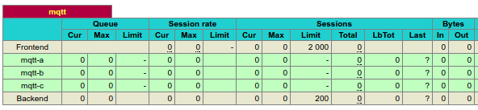
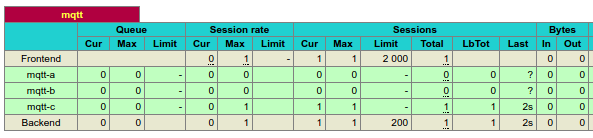
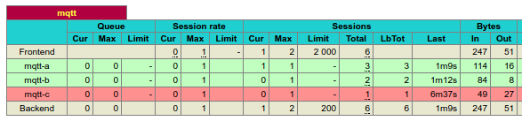

# VerneMQ cluster partition

Whilst investigating VerneMQ's data loss characteristics in the event of node loss and partitioning, I've encountered Erlang `CRASH REPORT` occurrences in the debug logs.

```
CRASH REPORT Process <0.1065.0> with 0 neighbours crashed with reason: no case clause matching {{case_clause,{badrpc,nodedown}},[{vmq_reg,'-register_subscriber/4-fun-0-',2,[{file,"/opt/vernemq/distdir/1.0.1/_build/default/lib/vmq_server/src/vmq_reg.erl"},{line,182}]},{vmq_reg,block_until_migrated,4,[{file,"/opt/vernemq/distdir/1.0.1/_build/default/lib/vmq_server/src/vmq_reg.erl"},{line,249}]},{vmq_reg,register_subscriber,4,[{file,"/opt/vernemq/distdir/1.0.1/_build/default/lib/vmq_server/src/vmq_reg.erl"},{line,194}]},{vmq_reg_sync_action,'-init/1-fun-0-',1,[{file,"/opt/vernemq/distdi..."},...]}]} in vmq_mqtt_fsm:check_user/2 line 553
```

This occurs when a subscriber reconnects following a node outage (see detailed steps below).

I'd like to understand whether this is expected behaviour or a bug.

Do the occurrences of such reports compromise the integrity and service-level of a cluster in any way?

## Prerequisites

To bring up the demonstration cluster via `docker-compose` you'll need an AWS account and the `aws` CLI tool.

Whilst everything runs in a local Docker composition, a remote bucket is used for discovery purposes.

Cost footprint should be negligible.

## Instructions

1. Create the bucket into which node discovery information will be placed.

        aws s3api create-bucket --bucket vernemq-discovery --region eu-west-1

2. Build the `vernemq` Docker image - this implements a crude form of S3-based service-discovery

        make docker-build

3. Bring up the cluster

        make docker-up

Log output looks sane: https://gist.github.com/codeasone/ff2952f773481e998e46dbc94e46e3e0

HAProxy reports healthy:



4. Confirm cluster formation

        docker exec -it vernemqdataloss_mqtt-a_1 bash -c 'vmq-admin cluster show'

```
+------------------+-------+
|       Node       |Running|
+------------------+-------+
|VerneMQ@172.26.0.2| true  |
|VerneMQ@172.26.0.3| true  |
|VerneMQ@172.26.0.4| true  |
+------------------+-------+
```

5. Start test subscriber with `clean-session=false`

        mosquitto_sub -t resume-test -c -i resume-test -q 1 -d

__Note:__ I can see from the HAProxy stats that the subscriber connected to `mqtt-c`



6. Publish a test message "A"

        mosquitto_pub -t resume-test -q 1 -d -m "A"

The subscriber receives this as expected:

```
Client resume-test received PUBLISH (d0, q1, r0, m1, 'resume-test', ... (1 bytes))
Client resume-test sending PUBACK (Mid: 1)
A
```

7. Disconnect test subscriber to simulate a temporary device failure (for the sake of discussion lets assume this is many minutes)

        <kill mosquitto_sub process>

8. Publish two more test messages which we expect our subscriber to resume on re-connection to the cluster

        mosquitto_pub -t resume-test -q 1 -d -m "B"
        mosquitto_pub -t resume-test -q 1 -d -m "C"

9. Now we knock out `mqtt-c` ungracefully to simulate a real-life node failure or partition

        docker-compose kill mqtt-c

The loss is acknowledged by the cluster:

```
vernemqdataloss_mqtt-c_1 exited with code 137
mqtt-b_1       | 2017-05-19 11:21:41.384 [warning] <0.343.0>@vmq_cluster_mon:handle_info:122 cluster node 'VerneMQ@172.26.0.2' DOWN
mqtt-a_1       | 2017-05-19 11:21:41.385 [warning] <0.343.0>@vmq_cluster_mon:handle_info:122 cluster node 'VerneMQ@172.26.0.2' DOWN
```

HAProxy shows the node as down:



10. Reconnect the original test subscriber

        mosquitto_sub -t resume-test -c -i resume-test -q 1 -d

```
Client resume-test sending CONNECT
Client resume-test sending CONNECT
Client resume-test received CONNACK
Client resume-test sending SUBSCRIBE (Mid: 1, Topic: resume-test, QoS: 1)
Client resume-test received SUBACK
Subscribed (mid: 1): 1
```

__Issue:__ HAProxy first routes the connection to to `mqtt-b`, which fails, so the subscriber retries and successfully connects to `mqtt-a`

The node logs are as follows:

```
mqtt-b_1       | 2017-05-19 11:23:23.133 [error] emulator Error in process <0.1067.0> on node 'VerneMQ@172.26.0.3' with exit value:
mqtt-b_1       | {{case_clause,{badrpc,nodedown}},[{vmq_reg,'-register_subscriber/4-fun-0-',2,[{file,"/opt/vernemq/distdir/1.0.1/_build/default/lib/vmq_server/src/vmq_reg.erl"},{line,182}]},{vmq_reg,block_until_migrated,4,[{file,"/opt/vernemq/distdir/1.0.1/_build/default/lib/vmq_server/src/vmq_reg.erl"},{line,249}]},{vmq_reg,register_subscriber,4,[{file,"/opt/vernemq/distdir/1.0.1/_build/default/lib/vmq_server/src/vmq_reg.erl"},{line,194}]},{vmq_reg_sync_action,'-init/1-fun-0-',1,[{file,"/opt/vernemq/distdir/1.0.1/_build/default/lib/vmq_server/src/vmq_reg_sync_action.erl"},{line,52}]}]}
mqtt-b_1       | 2017-05-19 11:23:23.134 [error] <0.1065.0> CRASH REPORT Process <0.1065.0> with 0 neighbours crashed with reason: no case clause matching {{case_clause,{badrpc,nodedown}},[{vmq_reg,'-register_subscriber/4-fun-0-',2,[{file,"/opt/vernemq/distdir/1.0.1/_build/default/lib/vmq_server/src/vmq_reg.erl"},{line,182}]},{vmq_reg,block_until_migrated,4,[{file,"/opt/vernemq/distdir/1.0.1/_build/default/lib/vmq_server/src/vmq_reg.erl"},{line,249}]},{vmq_reg,register_subscriber,4,[{file,"/opt/vernemq/distdir/1.0.1/_build/default/lib/vmq_server/src/vmq_reg.erl"},{line,194}]},{vmq_reg_sync_action,'-init/1-fun-0-',1,[{file,"/opt/vernemq/distdi..."},...]}]} in vmq_mqtt_fsm:check_user/2 line 553
mqtt-b_1       | 2017-05-19 11:23:23.134 [error] <0.1065.0> Ranch listener {{0,0,0,0},1883} terminated with reason: {case_clause,{{case_clause,{badrpc,nodedown}},[{vmq_reg,'-register_subscriber/4-fun-0-',2,[{file,"/opt/vernemq/distdir/1.0.1/_build/default/lib/vmq_server/src/vmq_reg.erl"},{line,182}]},{vmq_reg,block_until_migrated,4,[{file,"/opt/vernemq/distdir/1.0.1/_build/default/lib/vmq_server/src/vmq_reg.erl"},{line,249}]},{vmq_reg,register_subscriber,4,[{file,"/opt/vernemq/distdir/1.0.1/_build/default/lib/vmq_server/src/vmq_reg.erl"},{line,194}]},{vmq_reg_sync_action,'-init/1-fun-0-',1,[{file,"/opt/v..."},...]}]}}
mqtt-a_1       | 2017-05-19 11:23:28.273 [info] <0.1064.0>@plumtree_metadata_exchange_fsm:exchange:160 completed metadata exchange with 'VerneMQ@172.26.0.3'. repaired 0 missing local prefixes, 0 missing remote prefixes, and 1 keys
```

__Question:__ That `CRASH REPORT` doesn't look right. Is cluster integrity compromised?

11. Next, publish two more messages `D` and `E` in the test sequence `A (B C) D E` where `(B C)` only exist within the LevelDB `msgstore` of `mqtt-c`, which is still out of the picture...

As expected, those messages are received just fine:

```
Client resume-test received PUBLISH (d0, q1, r0, m1, 'resume-test', ... (1 bytes))
Client resume-test sending PUBACK (Mid: 1)
D
Client resume-test received PUBLISH (d0, q1, r0, m2, 'resume-test', ... (1 bytes))
Client resume-test sending PUBACK (Mid: 2)
E
```

So far, our test subscriber has received `A D E`.

12. Restore node `mqtt-c`

```
docker-compose run mqtt-c
Starting: 22a11cbb6b3d 172.26.0.2
Registering: 172.26.0.2
Discovering nodes via S3 bucket
[2017-05-19T11:32:19Z]:join VerneMQ@172.26.0.2
Couldn't join cluster due to self_join

[2017-05-19T11:32:19Z]:join VerneMQ@172.26.0.3
Done
[2017-05-19T11:32:19Z]:join VerneMQ@172.26.0.4
Done
2017-05-19 11:32:05.929 [info] <0.31.0> Application hackney started on node 'VerneMQ@172.26.0.2'
2017-05-19 11:32:06.728 [info] <0.341.0>@vmq_reg_trie:handle_info:183 loaded 1 subscriptions into vmq_reg_trie
2017-05-19 11:32:06.734 [info] <0.226.0>@vmq_cluster:init:113 plumtree peer service event handler 'vmq_cluster' registered
2017-05-19 11:32:07.299 [info] <0.31.0> Application vmq_acl started on node 'VerneMQ@172.26.0.2'
2017-05-19 11:32:07.385 [info] <0.31.0> Application vmq_passwd started on node 'VerneMQ@172.26.0.2'
2017-05-19 11:32:07.454 [error] <0.421.0> Failed to start Ranch listener {{127,0,0,1},8888} in ranch_tcp:listen([{ip,{127,0,0,1}},{port,8888},{nodelay,true},{linger,{true,0}},{send_timeout,30000},{send_timeout_close,true}]) for reason eaddrinuse (address already in use)
2017-05-19 11:32:07.454 [error] <0.421.0> CRASH REPORT Process <0.421.0> with 0 neighbours exited with reason: {listen_error,{{127,0,0,1},8888},eaddrinuse} in gen_server:init_it/6 line 352
2017-05-19 11:32:07.454 [error] <0.419.0> Supervisor {<0.419.0>,ranch_listener_sup} had child ranch_acceptors_sup started with ranch_acceptors_sup:start_link({{127,0,0,1},8888}, 10, ranch_tcp, [{ip,{127,0,0,1}},{port,8888},{nodelay,true},{linger,{true,0}},{send_timeout,30000},{send_timeout_close,...}]) at undefined exit with reason {listen_error,{{127,0,0,1},8888},eaddrinuse} in context start_error
2017-05-19 11:32:07.454 [error] <0.247.0>@vmq_ranch_config:reconfigure_listeners_for_type:187 can't reconfigure http listener({127,0,0,1}, 8888) with Options [{max_connections,10000},{nr_of_acceptors,10},{config_mod,vmq_http_config},{config_fun,config},{proxy_protocol,false}] due to {{shutdown,{failed_to_start_child,ranch_acceptors_sup,{listen_error,{{127,0,0,1},8888},eaddrinuse}}},{child,undefined,{ranch_listener_sup,{{127,0,0,1},8888}},{ranch_listener_sup,start_link,[{{127,0,0,1},8888},10,ranch_tcp,[{ip,{127,0,0,1}},{port,8888},{nodelay,true},{linger,{true,0}},{send_timeout,30000},{send_timeout_close,true}],cowboy_protocol,[{env,[{dispatch,[{'_',[],[{[<<"metrics">>],[],vmq_metrics_http,[]},{[<<"api">>,<<"v1">>,'...'],[],vmq_http_mgmt_api,[]}]}]}]}]]},permanent,infinity,supervisor,[ranch_listener_sup]}}
2017-05-19 11:32:07.454 [info] <0.31.0> Application vmq_server started on node 'VerneMQ@172.26.0.2'
2017-05-19 11:32:19.329 [info] <0.449.0>@plumtree_peer_service:attempt_join:50 Sent join request to: 'VerneMQ@172.26.0.3'
2017-05-19 11:32:19.466 [info] <0.452.0>@plumtree_peer_service:attempt_join:50 Sent join request to: 'VerneMQ@172.26.0.4'
```

- `(B C)` are immediately sent to our test subscriber, but overall order is still compromised `A D E B C`, which given causal dependencies of the system-under-development may not be viable.

# Observations

- VerneMQ comes with a default configuration that trades availability for consistency with regard to MQTT's QoS provisions (in CAP terms it's a CP system)

- When a node dies, or a cluster experiences a network partition, no new connections or publications are possible until conditions are restored, thus ensuring subscribers receive a consistent [linearizable](https://martin.kleppmann.com/2015/05/linearizability.png) view of the world as publishers intended.

- Consistency can be traded off against higher availability without message loss. The following settings allow new connections, subscriptions, and publications to be delivered by a cluster that has lost some capacity through node loss, or partitioning:

```
allow_register_during_netsplit = on
allow_publish_during_netsplit = on
allow_subscribe_during_netsplit = on
allow_unsubscribe_during_netsplit = on
```

- Increased availability comes at the cost of linearizability.

- `CRASH REPORT` log entries suggest cluster state may be compromised.
